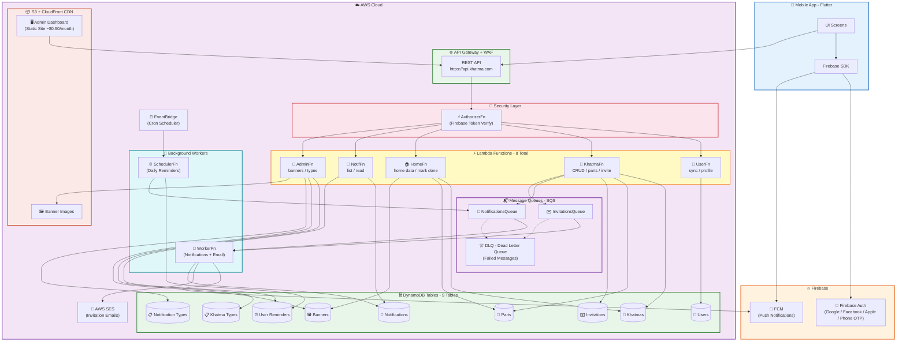

# 🏗️ Khatma - System Architecture

> الصورة الكاملة لبنية المشروع

## 📋 ملخص المكونات

| المكون | العدد | الوصف |
|--------|-------|-------|
| Lambda Functions | 8 | API + Workers + Scheduler |
| DynamoDB Tables | 9 | NoSQL Database |
| SQS Queues | 2 + 2 DLQ | Message Queues |
| S3 Buckets | 2 | Admin Dashboard + Images |
| Firebase | Auth + FCM | Login + Notifications |

