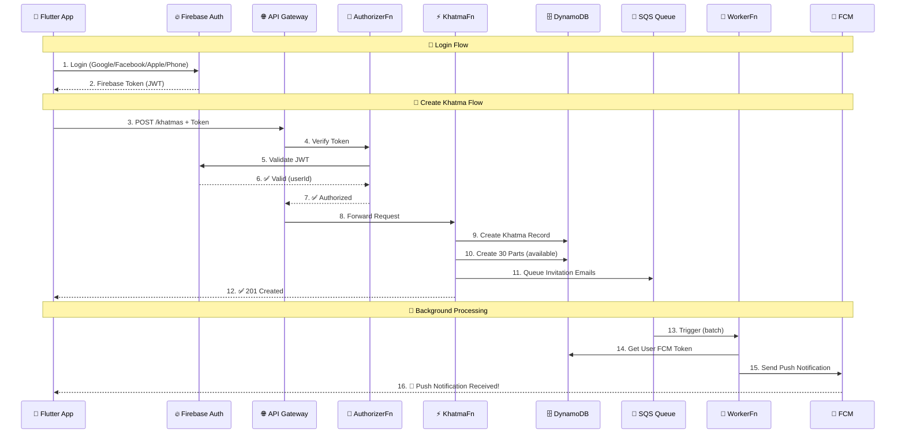
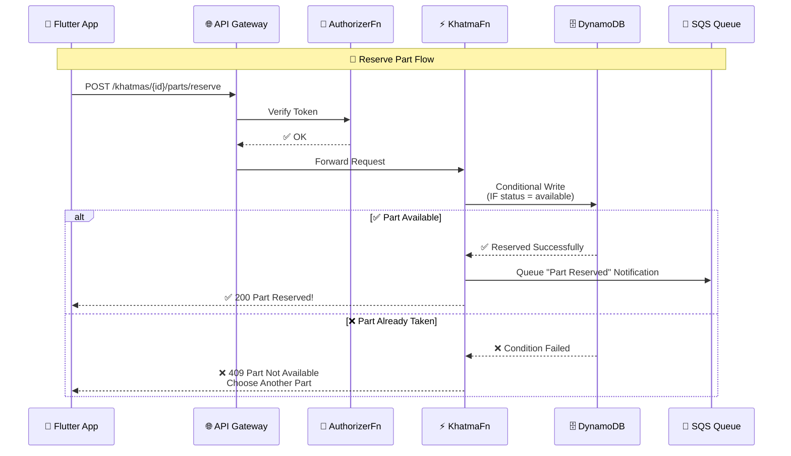
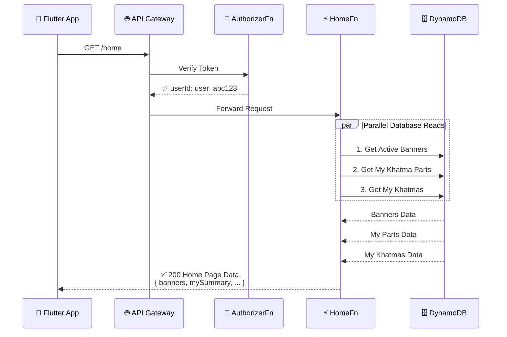
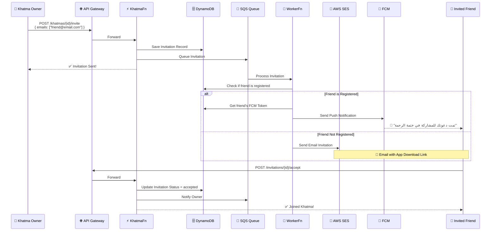

# 🔄 Khatma - Request Flow

> مسار الطلب من الموبايل للسيرفر والرد

## 1. Login + Create Khatma + Reserve Part

## 2. Reserve Part Flow (مع حماية Race Condition)

## 3. Home Page Data Flow

## 4. Invitation Flow

