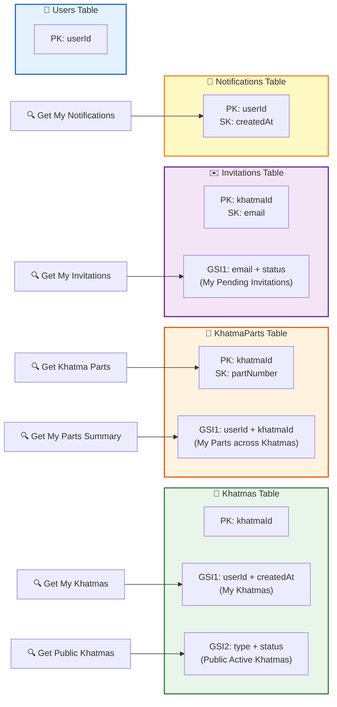

# 🗄️ Khatma - Database Schema (DynamoDB)

> تصميم قاعدة البيانات - 9 جداول

## Entity Relationship Diagram

```mermaid
erDiagram
    USERS {
        string userId PK "Firebase UID"
        string email "user@email.com"
        string displayName "Ahmed Mohamed"
        string photoUrl "https://..."
        string authProvider "google/facebook/apple/phone"
        string fcmToken "Firebase Cloud Messaging Token"
        string language "ar/en/ur/hi"
        string role "user/admin"
        string countryCode "+20"
        string phoneNumber "1234567890"
        string createdAt "ISO Date"
        string updatedAt "ISO Date"
    }

    KHATMAS {
        string khatmaId PK "kh_uuid"
        string userId FK "Creator's userId"
        string name "ختمة الرحمة"
        string intention "على روح أبيها"
        string type "private/by_invitation/public"
        string khatmaTypeId FK "Khatma Type ref"
        string status "active/completed"
        number totalParts "30"
        number completedParts "0-30"
        string shareLink "https://app.khatma.com/join/kh_xxx"
        string createdAt "ISO Date"
        string updatedAt "ISO Date"
    }

    KHATMA_PARTS {
        string khatmaId PK "Partition Key"
        number partNumber SK "1-30 Sort Key"
        string userId FK "Who reserved it"
        string status "available/reserved/completed"
        string reservedAt "ISO Date"
        string completedAt "ISO Date"
    }

    KHATMA_INVITATIONS {
        string khatmaId PK "Partition Key"
        string email SK "Sort Key"
        string invitedBy FK "Owner userId"
        string invitedUserId FK "If registered"
        string status "pending/accepted/declined"
        string sentAt "ISO Date"
        string respondedAt "ISO Date"
    }

    KHATMA_TYPES {
        string typeId PK "type_uuid"
        string name_ar "ختمة رمضان"
        string name_en "Ramadan Khatma"
        string name_ur "رمضان ختم"
        string name_hi "रमज़ान खतम"
        string description_ar "وصف بالعربي"
        string description_en "English desc"
        string icon "icon_url or icon_name"
        boolean isActive "true/false"
        number sortOrder "1,2,3..."
        string createdAt "ISO Date"
    }

    BANNERS {
        string bannerId PK "banner_uuid"
        string title_ar "عنوان بالعربي"
        string title_en "English Title"
        string title_ur "اردو عنوان"
        string title_hi "हिंदी शीर्षक"
        string imageUrl "S3 URL"
        string linkUrl "Deep link or URL"
        boolean isActive "true/false"
        number sortOrder "1,2,3..."
        string startDate "ISO Date"
        string endDate "ISO Date"
        string createdAt "ISO Date"
    }

    NOTIFICATIONS {
        string userId PK "Partition Key"
        string createdAt SK "Sort Key"
        string notificationId "Unique ID"
        string type "invitation/progress/completion/welcome/motivational"
        string subType "farah/ramadan/shifa"
        string title "Notification Title"
        string body "Notification Body"
        boolean isRead "true/false"
        string data "JSON metadata"
        string actionType "join_now/skip/open_khatma"
        string actionId "khatmaId or invitationId"
    }

    USER_REMINDERS {
        string userId PK "Partition Key"
        string reminderTime "08:00"
        string timezone "Asia/Riyadh"
        boolean isEnabled "true/false"
        string lastSentAt "ISO Date"
    }

    NOTIFICATION_TYPES {
        string typeId PK "notif_type_uuid"
        string type "motivational/progress/completion/welcome"
        string subType "farah/ramadan/shifa"
        string template_ar "وردك لا يزال في انتظارك"
        string template_en "Your wird is still waiting"
        string template_ur "آپ کا ورد ابھی بھی منتظر ہے"
        string template_hi "आपका विर्द अभी भी इंतजार कर रहा है"
        boolean isActive "true/false"
        string createdAt "ISO Date"
    }

    USERS ||--o{ KHATMAS : "creates"
    USERS ||--o{ KHATMA_PARTS : "reserves"
    USERS ||--o{ NOTIFICATIONS : "receives"
    USERS ||--|| USER_REMINDERS : "has"
    KHATMAS ||--|{ KHATMA_PARTS : "has 30 parts"
    KHATMAS ||--o{ KHATMA_INVITATIONS : "has invitations"
    KHATMA_TYPES ||--o{ KHATMAS : "categorizes"
    NOTIFICATION_TYPES ||--o{ NOTIFICATIONS : "templates"
```

## 📊 DynamoDB Access Patterns



## 📋 Tables Summary

| Table | PK | SK | GSI | الاستخدام |
|-------|----|----|-----|----------|
| Users | userId | - | - | بيانات المستخدمين |
| Khatmas | khatmaId | - | userId+createdAt, type+status | الختمات |
| KhatmaParts | khatmaId | partNumber | userId+khatmaId | أجزاء الختمة (30 جزء) |
| KhatmaInvitations | khatmaId | email | email+status | الدعوات |
| KhatmaTypes | typeId | - | - | أنواع الختمات (أدمن) |
| Banners | bannerId | - | - | البانرات (أدمن) |
| Notifications | userId | createdAt | - | الإشعارات |
| UserReminders | userId | - | - | التذكيرات اليومية |
| NotificationTypes | typeId | - | - | قوالب الإشعارات (أدمن) |

