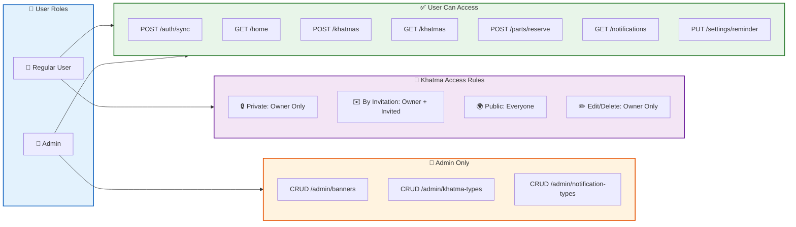
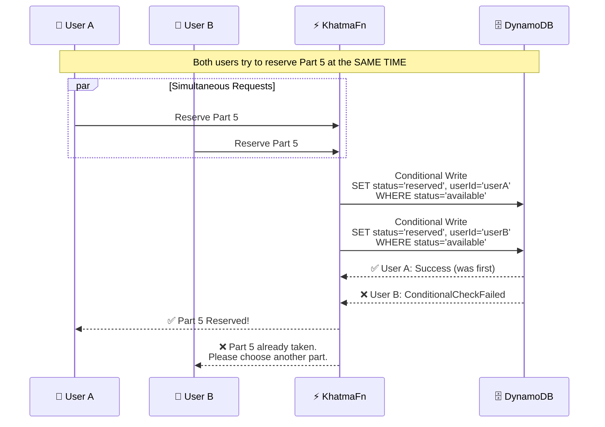

# 🔒 Khatma - Security Layers

> 5 طبقات حماية لتأمين المشروع

## Security Architecture Overview

```mermaid
graph TB
    Request["📱 Request from Mobile App<br/>POST /khatmas<br/>Authorization: Bearer eyJhb..."] --> Layer1

    subgraph Layer1["🛡️ Layer 1: API Gateway + WAF"]
        direction TB
        WAF["🔥 WAF - Web Application Firewall<br/>✅ Anti-DDoS Protection<br/>✅ Anti-SQL Injection<br/>✅ Anti-XSS (Cross-Site Scripting)<br/>✅ Block malicious IPs"]
        RL["⏱️ Rate Limiting + Throttling<br/>✅ Max 100 requests/sec per user<br/>✅ Auto-throttle on abuse<br/>✅ Return 429 Too Many Requests"]
        HTTPS["🔐 HTTPS Only<br/>✅ TLS 1.2+ Encryption<br/>✅ No plain HTTP allowed<br/>✅ SSL Certificate"]
        WAF --> RL --> HTTPS
    end

    Layer1 --> Layer2

    subgraph Layer2["🔐 Layer 2: Firebase Auth Verification"]
        direction TB
        TV["🎫 Token Validation<br/>✅ Verify JWT Signature (Google signed)<br/>✅ Check Token Expiration (1 hour)<br/>✅ Extract userId from Token<br/>✅ Impossible to forge"]
    end

    Layer2 -->|"❌ Invalid/Expired Token"| Reject1["🚫 401 Unauthorized<br/>Token is invalid or expired"]
    Layer2 -->|"✅ Valid Token ➜ userId extracted"| Layer3

    subgraph Layer3["👤 Layer 3: Authorization - Role & Permission Check"]
        direction TB
        RC["🔑 Permission Matrix<br/>✅ User Role: user vs admin<br/>✅ Khatma Owner: only owner can edit/delete<br/>✅ Private Khatma: only owner sees it<br/>✅ By Invitation: only owner + invited users<br/>✅ Admin APIs: admin role required"]
    end

    Layer3 -->|"❌ No Permission"| Reject2["🚫 403 Forbidden<br/>You don't have permission"]
    Layer3 -->|"✅ Authorized"| Layer4

    subgraph Layer4["✅ Layer 4: Input Validation & Sanitization"]
        direction TB
        IV["🧹 Data Validation<br/>✅ Schema Check (Joi/Zod library)<br/>✅ Type checking (string, number, etc.)<br/>✅ Size limits (name: 1-100 chars)<br/>✅ Sanitize input (remove HTML/scripts)<br/>✅ Allowed values only (type: public|private|by_invitation)"]
    end

    Layer4 -->|"❌ Invalid Input"| Reject3["🚫 400 Bad Request<br/>Invalid data provided"]
    Layer4 -->|"✅ Valid & Clean Data"| Layer5

    subgraph Layer5["🗄️ Layer 5: Database Security"]
        direction TB
        IAM["🔑 IAM Roles - Least Privilege<br/>✅ Each Lambda has specific permissions<br/>✅ KhatmaFn: read/write Khatmas + Parts only<br/>✅ AdminFn: read/write Banners + Types only<br/>✅ No Lambda can delete Users table"]
        ENC["🔒 Encryption<br/>✅ At Rest: AES-256 (data encrypted on disk)<br/>✅ In Transit: TLS (data encrypted during transfer)"]
        CW["⚡ Conditional Writes<br/>✅ Race Condition Protection<br/>✅ If 2 users reserve same part simultaneously<br/>✅ Only first one succeeds"]
        IAM --> ENC --> CW
    end

    Layer5 --> Success["✅ Success Response<br/>200 OK / 201 Created"]

    style Layer1 fill:#E8F5E9,stroke:#2E7D32,stroke-width:3px
    style Layer2 fill:#FFF3E0,stroke:#E65100,stroke-width:3px
    style Layer3 fill:#E3F2FD,stroke:#1565C0,stroke-width:3px
    style Layer4 fill:#FFF9C4,stroke:#F57F17,stroke-width:3px
    style Layer5 fill:#FCE4EC,stroke:#C62828,stroke-width:3px
    style Reject1 fill:#FFCDD2,stroke:#C62828,stroke-width:2px
    style Reject2 fill:#FFCDD2,stroke:#C62828,stroke-width:2px
    style Reject3 fill:#FFCDD2,stroke:#C62828,stroke-width:2px
    style Success fill:#C8E6C9,stroke:#2E7D32,stroke-width:2px
```

## 🔐 Permission Matrix

```mermaid
graph LR
    subgraph Roles["👥 User Roles"]
        User["👤 Regular User"]
        Admin["👑 Admin"]
    end

    subgraph UserAPIs["✅ User Can Access"]
        UA1["POST /auth/sync"]
        UA2["GET /home"]
        UA3["POST /khatmas"]
        UA4["GET /khatmas"]
        UA5["POST /parts/reserve"]
        UA6["GET /notifications"]
        UA7["PUT /settings/reminder"]
    end

    subgraph AdminAPIs["👑 Admin Only"]
        AA1["CRUD /admin/banners"]
        AA2["CRUD /admin/khatma-types"]
        AA3["CRUD /admin/notification-types"]
    end

    subgraph KhatmaRules["📖 Khatma Access Rules"]
        R1["🔒 Private: Owner Only"]
        R2["✉️ By Invitation: Owner + Invited"]
        R3["🌍 Public: Everyone"]
        R4["✏️ Edit/Delete: Owner Only"]
    end

    User --> UserAPIs
    Admin --> UserAPIs
    Admin --> AdminAPIs
    User --> KhatmaRules

    style Roles fill:#E3F2FD,stroke:#1565C0,stroke-width:2px
    style UserAPIs fill:#E8F5E9,stroke:#2E7D32,stroke-width:2px
    style AdminAPIs fill:#FFF3E0,stroke:#E65100,stroke-width:2px
    style KhatmaRules fill:#F3E5F5,stroke:#6A1B9A,stroke-width:2px
```

## ⚡ Race Condition Protection (حماية الحجز المتزامن)

```mermaid
sequenceDiagram
    participant U1 as 👤 User A
    participant U2 as 👤 User B
    participant Lambda as ⚡ KhatmaFn
    participant DB as 🗄️ DynamoDB

    Note over U1,DB: Both users try to reserve Part 5 at the SAME TIME

    par Simultaneous Requests
        U1->>Lambda: Reserve Part 5
        U2->>Lambda: Reserve Part 5
    end

    Lambda->>DB: Conditional Write<br/>SET status='reserved', userId='userA'<br/>WHERE status='available'
    Lambda->>DB: Conditional Write<br/>SET status='reserved', userId='userB'<br/>WHERE status='available'

    DB-->>Lambda: ✅ User A: Success (was first)
    DB-->>Lambda: ❌ User B: ConditionalCheckFailed

    Lambda-->>U1: ✅ Part 5 Reserved!
    Lambda-->>U2: ❌ Part 5 already taken.<br/>Please choose another part.
```

