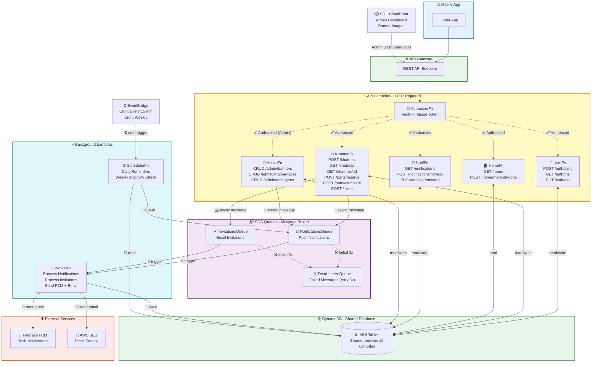
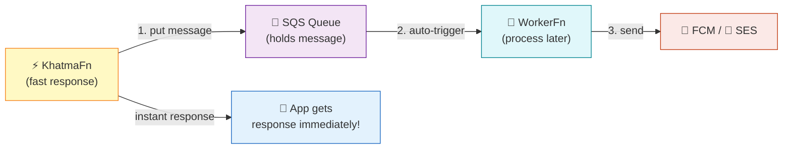
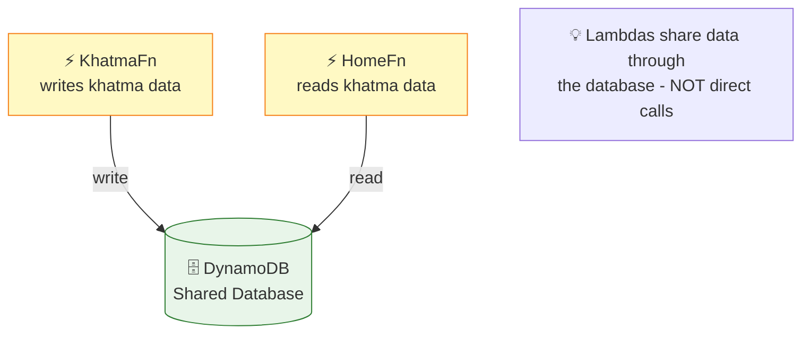
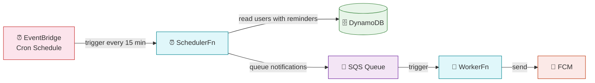
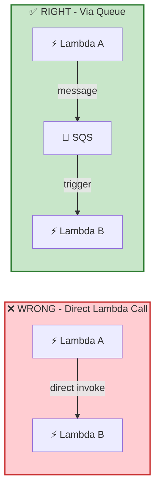

# 🔗 Khatma - Lambda Communication

> إزاي الـ Lambdas بتتواصل مع بعض (من غير ما تكلم بعض مباشرة)

## Communication Map

## 🔗 3 Communication Patterns

### Pattern 1: Via SQS Queue (Async - الأساسي)

### Pattern 2: Via DynamoDB (Shared Data)

### Pattern 3: Via EventBridge (Scheduled)

## 🚫 القاعدة الذهبية

### ليه؟
- ❌ Direct Call = لو Lambda B وقعت، Lambda A تقع معاها + بتدفع double
- ✅ Via Queue = لو Worker وقع، الرسالة محفوظة في Queue وتتعاد تلقائياً

