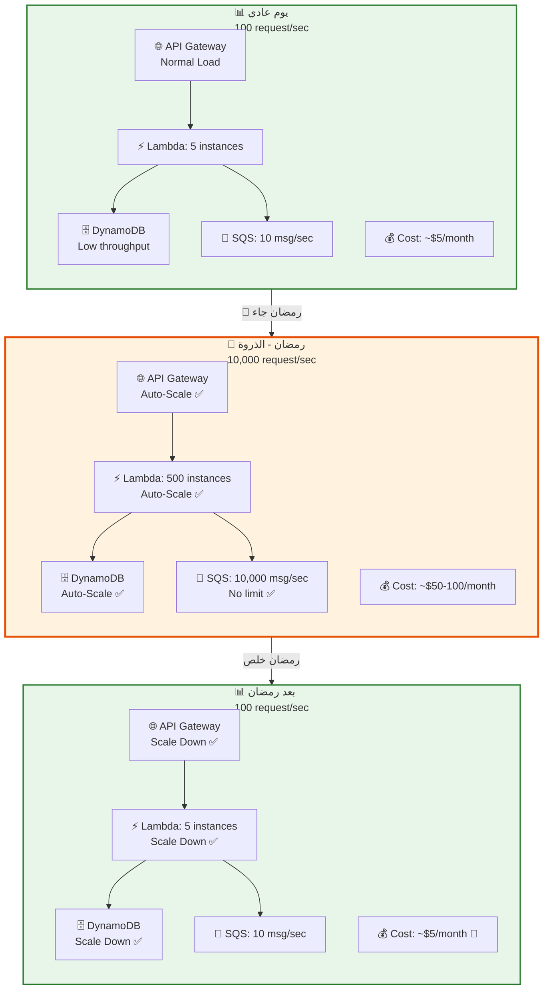
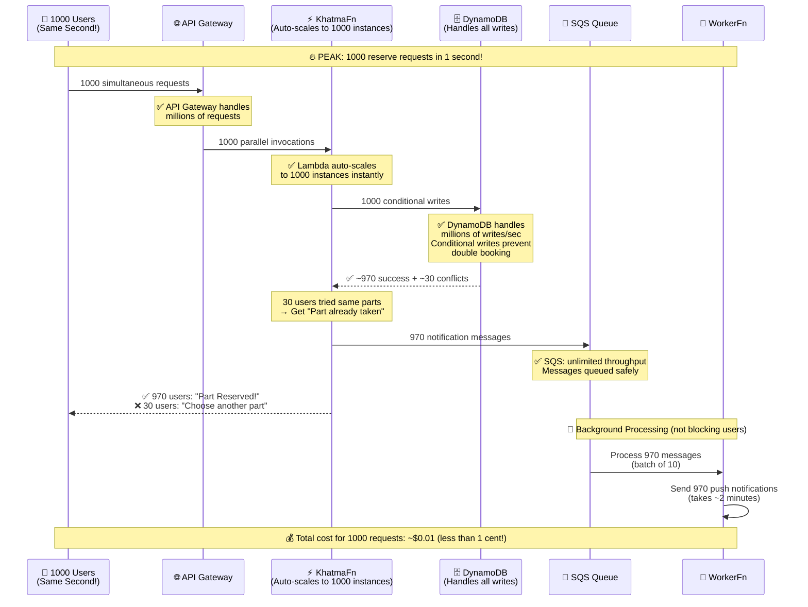
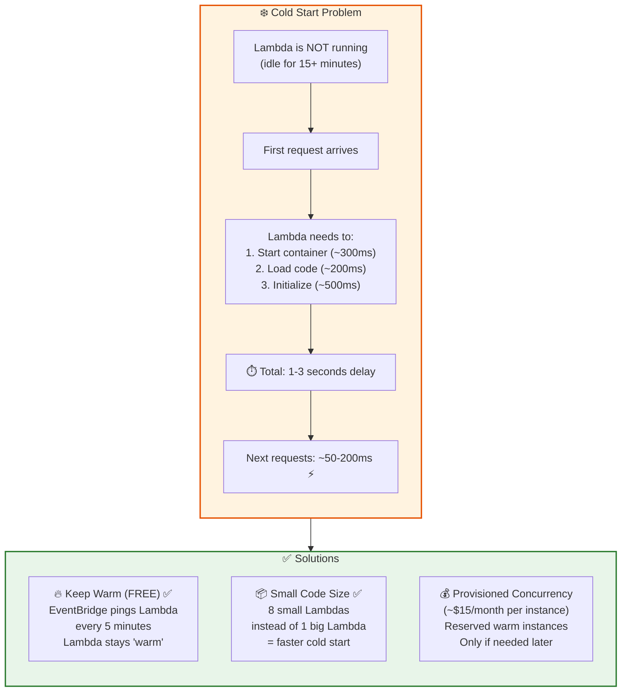
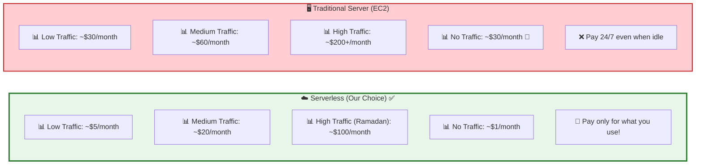
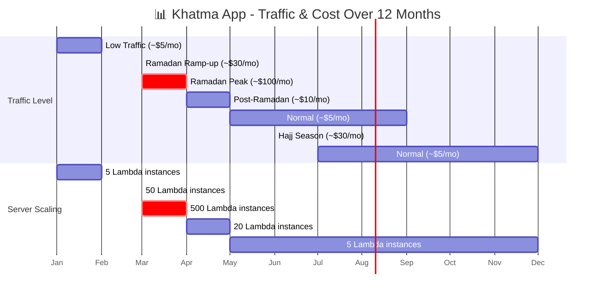

# ⚡ Khatma - Peak Traffic & Auto-Scaling

> إزاي النظام بيتعامل مع أوقات الذروة (رمضان مثلاً)

## Auto-Scaling Overview

## ⚡ Peak Scenario: 1000 User Reserve Parts at Same Time

## ❄️ Cold Start Handling

## 💰 Cost Comparison

## 📊 Auto-Scaling Timeline (Ramadan Example)

