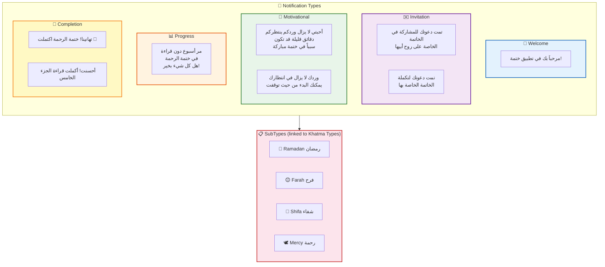

# 📱 Khatma - App Screens Flow

> تنقل الشاشات في التطبيق

## Full App Navigation

```mermaid
graph TB
    Start(("🚀 App<br/>Launch")) --> Splash["🎨 Splash Screen"]
    Splash --> CheckAuth{"🔐 User<br/>Logged In?"}

    CheckAuth -->|"No"| Login
    CheckAuth -->|"Yes"| Home

    subgraph Login["🔐 Login Screen"]
        direction TB
        FB["📘 Facebook Login"]
        Google["🔴 Google Login"]
        Apple["🍎 Apple Login"]
        Phone["📱 Phone Number"]
        Register["📝 Register Now"]
    end

    Phone --> PhoneFlow
    Register --> PhoneFlow

    subgraph PhoneFlow["📱 Phone Registration"]
        direction TB
        PF1["🌍 Country Code"]
        PF2["📱 Mobile Number"]
        PF3["🔑 Password"]
        PF4["📨 Send OTP"]
        PF5["🔢 Enter OTP"]
        PF6["🔄 Resend OTP"]
        PF1 --> PF2 --> PF3 --> PF4 --> PF5
        PF5 -.-> PF6
    end

    FB --> Home
    Google --> Home
    Apple --> Home
    PhoneFlow --> Home

    subgraph Home["🏠 Home Page"]
        direction TB
        H_Banner["🖼️ Banners Slider<br/>(from Admin)"]
        H_Summary["📊 Summary of My Chapters<br/>Ch.1 (3 Khatmas) ✅ Done<br/>Ch.2 (2 Khatmas) 📖 Reading<br/>Ch.3 (4 Khatmas) ✅ Done"]
        H_DoneAll["✅ Done All Chapters Button"]
        H_Show["📖 Show Khatmahs Button"]
        H_Khatmas["📚 Khatmahs Button"]
        H_New["➕ New Khatmah Button"]
        H_Notif["🔔 Notifications Icon"]
        H_Settings["⚙️ Settings Icon"]
    end

    H_Show --> PublicList
    H_Khatmas --> KhatmahsTabs
    H_New --> NewKhatma
    H_Notif --> Notifications
    H_Settings --> Settings

    subgraph PublicList["📖 Public Khatmahs List"]
        direction TB
        PL1["📖 Khatmah 1<br/>Name + Intention"]
        PL2["📖 Khatmah 2<br/>Name + Intention"]
        PL3["📑 Rest of Chapters Button"]
    end

    PL3 --> SelectChapters

    subgraph SelectChapters["📑 Select Chapters"]
        direction TB
        SC_Grid["📊 30 Chapters Grid<br/>🟢 Available (can select)<br/>⬜ Reserved (taken)<br/>🟡 Completed (done)"]
        SC_Btn["✅ Select Chapters Button"]
    end

    subgraph KhatmahsTabs["📚 Khatmahs - 3 Tabs"]
        direction TB
        Tab1["✉️ Tab 1: Invited On"]
        Tab2["👤 Tab 2: My Khatmahs"]
        Tab3["🌍 Tab 3: Public (Not Invited)"]
    end

    subgraph Tab1Detail["✉️ Invited Khatmah Card"]
        direction TB
        T1_Name["📝 Khatmah Name"]
        T1_Intent["💭 Intention"]
        T1_Banner["🖼️ Banner/Image"]
        T1_Chapters["📑 Selected Chapters"]
        T1_Extra["➕ Add Extra Chapter"]
    end

    subgraph Tab2Detail["👤 My Khatmah Card"]
        direction TB
        T2_Name["📝 Khatmah Name"]
        T2_Intent["💭 Intention"]
        T2_Banner["🖼️ Banner/Image"]
        T2_Chapters["📑 Selected Chapters"]
        T2_Extra["➕ Add Extra Chapter"]
    end

    subgraph Tab3Detail["🌍 Public Khatmah Card"]
        direction TB
        T3_Chapters["📑 Available Chapters"]
        T3_Join["✅ Join Button"]
    end

    Tab1 --> Tab1Detail
    Tab2 --> Tab2Detail
    Tab3 --> Tab3Detail
    Tab1Detail --> SingleKhatma
    Tab2Detail --> SingleKhatma
    Tab3Detail --> SelectChapters

    subgraph SingleKhatma["📖 Single Khatmah Page"]
        direction TB
        SK_Name["📝 Khatmah Name"]
        SK_Intent["💭 Intention"]
        SK_Link["🔗 Share Link"]
        SK_Share["📤 Share Button<br/>(WhatsApp, Telegram, etc.)"]
        SK_Parts["👥 All Participants<br/>👤 Ahmed - Ch.1 ✅ Done<br/>👤 Mohamed - Ch.2 📖 Reading<br/>👤 Sara - Ch.5 ✅ Done"]
    end

    subgraph NewKhatma["➕ New Khatmah"]
        direction TB
        NK_Intent["💭 Intention Input"]
        NK_Name["📝 Name Input"]
        NK_Type{"📋 Type Selection"}
        NK_Private["🔒 Private<br/>(show only for me)"]
        NK_Invitation["✉️ By Invitation<br/>(me + invited only)"]
        NK_Public["🌍 Public<br/>(anyone can join)"]
        NK_Invite["✉️ Invite Friends<br/>(Enter Emails)"]
        NK_Share["📤 Share Button"]
        NK_Create["✅ Create Khatmah"]

        NK_Intent --> NK_Name --> NK_Type
        NK_Type --> NK_Private
        NK_Type --> NK_Invitation
        NK_Type --> NK_Public
        NK_Invitation --> NK_Invite
        NK_Invite --> NK_Create
        NK_Private --> NK_Create
        NK_Public --> NK_Create
        NK_Create --> NK_Share
    end

    subgraph Notifications["🔔 Notifications Page"]
        direction TB
        N1["✉️ تمت دعوتك للمشاركة<br/>في الخاتمة الخاصة على روح أبيها<br/>🟢 Join Now  |  ⬜ Skip"]
        N2["📖 تمت دعوتك لتكملة<br/>الخاتمة الخاصة بها<br/>🟢 Join Now  |  ⬜ Skip"]
        N3["💚 أحبتي لا يزال وردكم<br/>ينتظركم دقائق قليلة قد تكون<br/>سبباً في ختمة مباركة"]
        N4["⚠️ مر أسبوع دون قراءة<br/>في ختمة الرحمة<br/>هل كل شيء بخير!"]
        N5["📖 وردك لا يزال في انتظارك<br/>يمكنك البدء من حيث توقفت"]
    end

    subgraph Settings["⚙️ Settings"]
        direction TB
        S_Lang["🌍 Language<br/>🇸🇦 Arabic | 🇬🇧 English<br/>🇵🇰 Urdu | 🇮🇳 Hindi"]
        S_Remind["⏰ Daily Reminder<br/>🔛 Enable/Disable<br/>🕐 Time Picker"]
        S_Profile["👤 Profile Edit"]
        S_Logout["🚪 Logout"]
    end

    N1 -->|"Join Now"| SingleKhatma
    NewKhatma --> Home
    SelectChapters --> Home

    style Start fill:#FF6F00,stroke:#E65100,stroke-width:2px,color:#fff
    style Login fill:#FCE4EC,stroke:#C62828,stroke-width:2px
    style PhoneFlow fill:#F3E5F5,stroke:#6A1B9A,stroke-width:2px
    style Home fill:#E3F2FD,stroke:#1565C0,stroke-width:3px
    style PublicList fill:#E8F5E9,stroke:#2E7D32,stroke-width:2px
    style SelectChapters fill:#FFF9C4,stroke:#F57F17,stroke-width:2px
    style KhatmahsTabs fill:#FFF3E0,stroke:#E65100,stroke-width:2px
    style SingleKhatma fill:#F3E5F5,stroke:#6A1B9A,stroke-width:2px
    style NewKhatma fill:#E0F7FA,stroke:#00838F,stroke-width:2px
    style Notifications fill:#FBE9E7,stroke:#BF360C,stroke-width:2px
    style Settings fill:#ECEFF1,stroke:#37474F,stroke-width:2px
    style Tab1Detail fill:#FCE4EC,stroke:#C62828,stroke-width:1px
    style Tab2Detail fill:#E3F2FD,stroke:#1565C0,stroke-width:1px
    style Tab3Detail fill:#E8F5E9,stroke:#2E7D32,stroke-width:1px
```

## 🔔 Notification Types Flow

```mermaid
graph TB
    subgraph NotifTypes["🔔 Notification Types"]
        direction TB

        subgraph Welcome["👋 Welcome"]
            W1["مرحباً بك في تطبيق ختمة!"]
        end

        subgraph Invitation["✉️ Invitation"]
            I1["تمت دعوتك للمشاركة في الخاتمة<br/>الخاصة على روح أبيها"]
            I2["تمت دعوتك لتكملة<br/>الخاتمة الخاصة بها"]
        end

        subgraph Motivational["💚 Motivational"]
            M1["أحبتي لا يزال وردكم ينتظركم<br/>دقائق قليلة قد تكون<br/>سبباً في ختمة مباركة"]
            M2["وردك لا يزال في انتظارك<br/>يمكنك البدء من حيث توقفت"]
        end

        subgraph Progress["📊 Progress"]
            P1["مر أسبوع دون قراءة<br/>في ختمة الرحمة<br/>هل كل شيء بخير!"]
        end

        subgraph Completion["🎉 Completion"]
            C1["تهانينا! ختمة الرحمة اكتملت 🎉"]
            C2["أحسنت! أكملت قراءة الجزء الخامس"]
        end
    end

    subgraph SubTypes["📋 SubTypes (linked to Khatma Types)"]
        ST1["🌙 Ramadan رمضان"]
        ST2["😊 Farah فرح"]
        ST3["💊 Shifa شفاء"]
        ST4["🕊️ Mercy رحمة"]
    end

    NotifTypes --> SubTypes

    style Welcome fill:#E3F2FD,stroke:#1565C0,stroke-width:2px
    style Invitation fill:#F3E5F5,stroke:#6A1B9A,stroke-width:2px
    style Motivational fill:#E8F5E9,stroke:#2E7D32,stroke-width:2px
    style Progress fill:#FFF3E0,stroke:#E65100,stroke-width:2px
    style Completion fill:#FFF9C4,stroke:#F57F17,stroke-width:2px
    style SubTypes fill:#FCE4EC,stroke:#C62828,stroke-width:2px
```

## ⏰ Daily Reminder Flow

```mermaid
graph LR
    User["👤 User sets<br/>reminder: 08:00 AM"] --> Settings["⚙️ Save to<br/>UserReminders Table"]
    Settings --> EB["⏰ EventBridge<br/>runs every 15 min"]
    EB --> Scheduler["⏰ SchedulerFn<br/>checks: who has<br/>reminder at 08:00?"]
    Scheduler --> SQS["📨 SQS Queue"]
    SQS --> Worker["📨 WorkerFn"]
    Worker --> FCM["🔔 FCM Push"]
    FCM --> Phone["📱 User's Phone<br/>🔔 وردك لا يزال<br/>في انتظارك"]

    style User fill:#E3F2FD,stroke:#1565C0
    style Settings fill:#ECEFF1,stroke:#37474F
    style EB fill:#FCE4EC,stroke:#C62828
    style Scheduler fill:#E0F7FA,stroke:#00838F
    style SQS fill:#F3E5F5,stroke:#6A1B9A
    style Worker fill:#E0F7FA,stroke:#00838F
    style FCM fill:#FFF3E0,stroke:#E65100
    style Phone fill:#E8F5E9,stroke:#2E7D32
```

